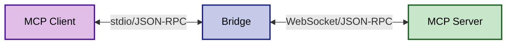
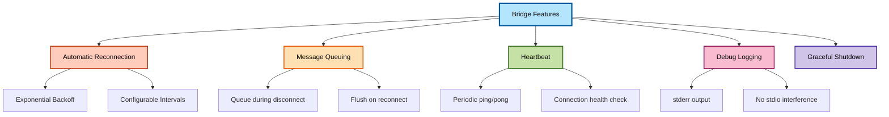
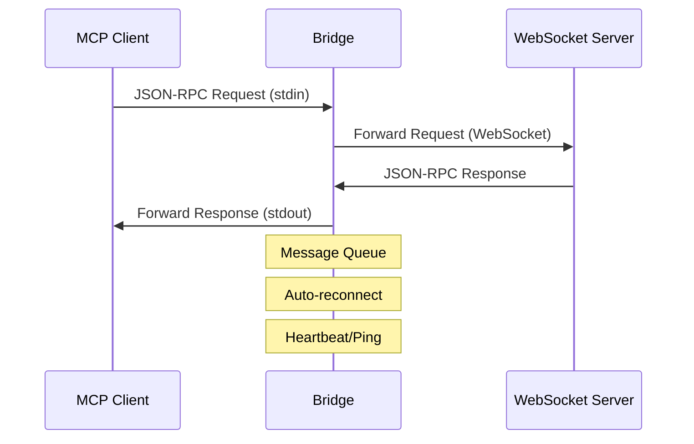
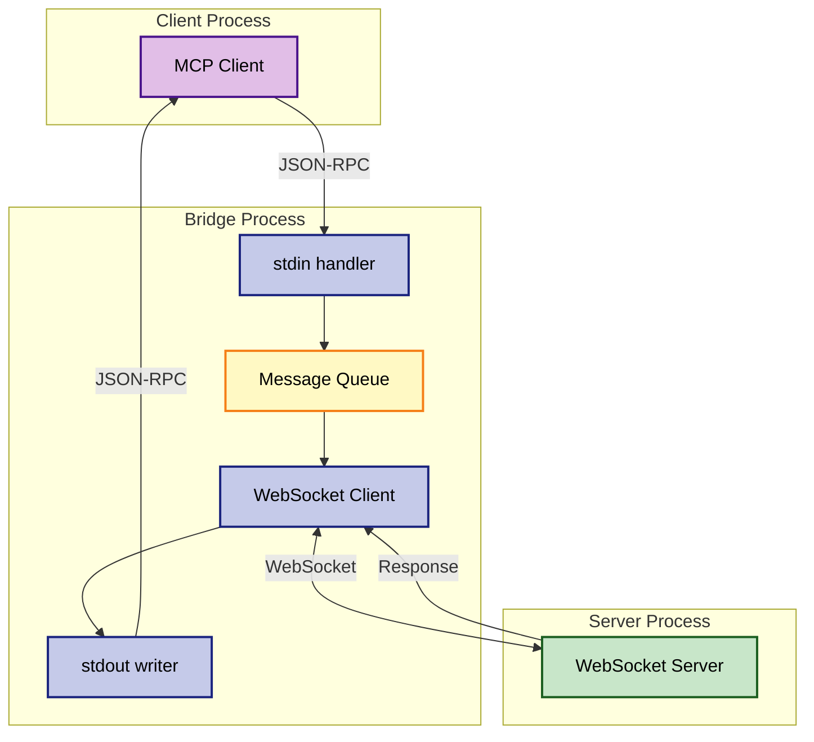

# mcp2websocket

A bridge application that enables MCP stdio clients to connect to WebSocket-based MCP servers by translating between stdio and WebSocket protocols.

## Overview

This bridge acts as a protocol translator:



- **Input**: Accepts MCP messages via stdio from MCP clients
- **Output**: Forwards messages over WebSocket to an MCP server

## Installation

```bash
npm install mcp2websocket
```

Or for local development:

```bash
git clone https://github.com/williamkapke/mcp2websocket.git
cd mcp2websocket
npm install
```

## Usage

### Command Line

```bash
# Connect to a WebSocket server
mcp2websocket ws://example.com:8080/mcp

# With authentication token
mcp2websocket wss://secure.example.com/mcp --token your-auth-token

# Enable debug logging
mcp2websocket --debug
```

### Configuration Examples

#### Claude Desktop

Add to your `claude_desktop_config.json`:

```json
{
  "mcpServers": {
    "websocket-server": {
      "command": "npx",
      "args": [
        "mcp2websocket",
        "ws://localhost:8765/mcp"
      ]
    }
  }
}
```

Or with environment variables:

```json
{
  "mcpServers": {
    "websocket-server": {
      "command": "npx",
      "args": ["mcp2websocket"],
      "env": {
        "AUTH_TOKEN": "optional-token",
        "DEBUG": "true"
      }
    }
  }
}
```

## Features



- **Automatic Reconnection**: Reconnects with exponential backoff when connection is lost
- **Message Queuing**: Queues messages during disconnection and sends when reconnected
- **Heartbeat**: Maintains connection with periodic ping/pong
- **Debug Logging**: Optional debug output to stderr (doesn't interfere with stdio protocol)
- **Graceful Shutdown**: Properly closes connections on exit

## Options

| Argument/Option | Short | Description | Default |
|-----------------|-------|-------------|---------|
| `<url>` | - | WebSocket server URL (required) | - |
| --token | -t | Authentication token | none |
| --debug | -d | Enable debug logging | false |
| --help | -h | Show help message | - |

## Environment Variables

- `AUTH_TOKEN`: Authentication token for server
- `DEBUG`: Set to "true" to enable debug logging

## Architecture



The bridge is transparent and doesn't modify messages - it simply forwards them between the two protocols while handling connection management.

### Message Flow



## Troubleshooting

1. **Connection Issues**: Enable debug mode to see detailed connection logs
2. **Authentication Errors**: Verify your token is correct and the server accepts it
3. **Message Errors**: Check that both the MCP client and the WebSocket server use compatible MCP versions

## Programmatic Usage

You can also import and use the bridge in your own Node.js application:

```javascript
const MCPWebSocketBridge = require('mcp2websocket');

// Create bridge instance
const bridge = new MCPWebSocketBridge('ws://localhost:8080/mcp', {
  token: 'optional-auth-token',
  debug: true
});

// Listen to events
bridge.on('connected', () => {
  console.log('Connected to WebSocket server');
});

bridge.on('disconnected', () => {
  console.log('Disconnected from WebSocket server');
});

bridge.on('error', (error) => {
  console.error('Bridge error:', error);
});

// Start the bridge
bridge.start();

// Gracefully shutdown when needed
process.on('SIGINT', () => {
  bridge.shutdown();
});
```

### Custom Stdio Streams

By default, the bridge uses `process.stdin` and `process.stdout`. You can override this by extending the class:

```javascript
const { Readable, Writable } = require('stream');
const MCPWebSocketBridge = require('mcp2websocket');

class CustomBridge extends MCPWebSocketBridge {
  constructor(options) {
    super(options);
    
    // Use custom streams instead of process.stdin/stdout
    this.rl = require('readline').createInterface({
      input: customInputStream,  // Your custom Readable stream
      output: customOutputStream, // Your custom Writable stream
      terminal: false
    });
  }
}

const bridge = new CustomBridge('ws://localhost:8080/mcp');
bridge.start();
```

## Development

To use in development mode:

1. Start your WebSocket MCP server
2. Configure your MCP client to use this bridge with the appropriate URL
3. The bridge will automatically connect and relay messages

## License

MIT